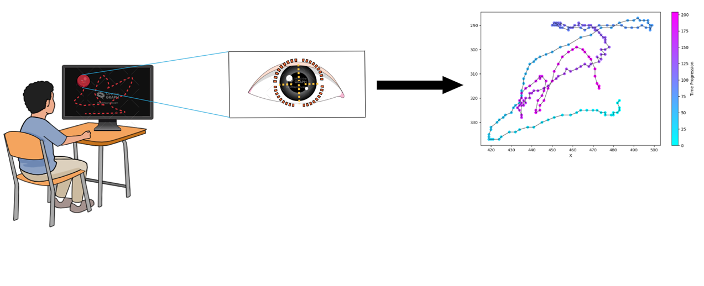
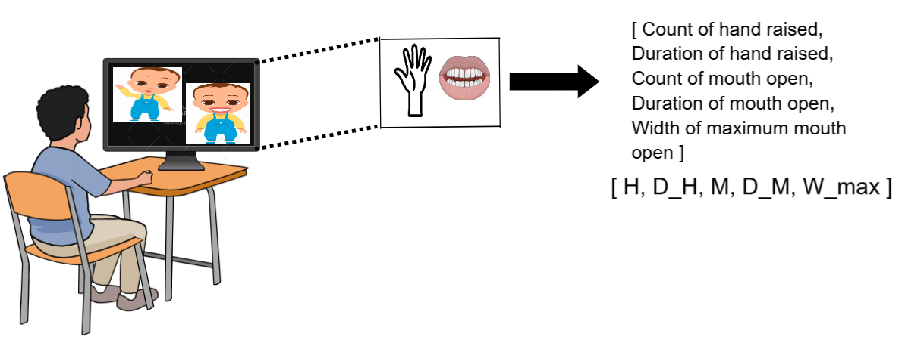
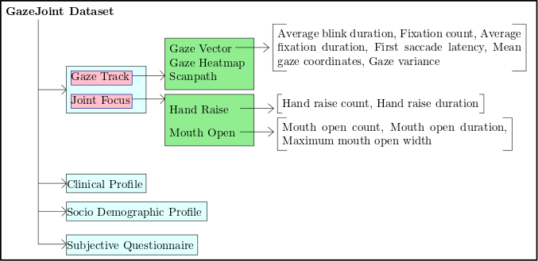

# GazeJoint Dataset

## Overview
The **GazeJoint Dataset** is a multimodal dataset designed for assessing Autism Spectrum Disorder (ASD) severity and joint attention behaviors in children. It includes eye-tracking data, behavioral annotations, clinical profiles, socio-demographic information, and subjective questionnaire responses.

This dataset can support research in cognitive development, AI-based ASD severity assessment, gaze analysis, and joint-attention studies.

---

## Data Collection Procedures

### Eye-Tracking Data Acquisition

### Joint Attention Data Acquisition

---

## Dataset Structure
The structure of the dataset is visualized in the figure below:

### Description

- **Gaze Track**  
  - **Gaze Vector:** Eye-tracking features extracted per video, including blink rate, fixation count, saccade latency, average gaze coordinates, and gaze variance. Stored in `.xlsx` files by severity category.  
  - **Gaze Heatmap:** Explainable AI heatmaps showing visual attention patterns, stored as `.png`.  
  - **Scanpath:** Eye-gaze scanpath visualizations, stored as `.png`.  

- **Joint Focus**  
  - **hand_features.xlsx:** Contains video identifier, ASD severity label, hand movement count and duration.  
  - **mouth_features.xlsx:** Contains video identifier, ASD severity label, mouth movement count, duration, and maximum mouth-opening width in centimeters.  

- **Clinical Profile.xlsx:** Prenatal, perinatal, and postnatal clinical observations, including medical history and psychiatric family history.  
- **Socio Demographic Profile.xlsx:** Participant socio-demographic information, including age, sex, parental ages, education, occupation, family type, and income.  
- **Subjective Questionnarie.xlsx:** Questionnaires completed per participant to assess behavioral and emotional aspects.

---

## Data Usage
This dataset can be used for:  
- ASD severity assessment  
- Joint attention analysis  
- Eye-tracking and gaze behavior studies  
- AI/ML model training for neurodevelopmental research  

Please cite the following reference when using the dataset:  
Debmani Saha, Kumari Rina, Deepshikha Ray, Kaushik Mukhopadhyay, Ayoleena Roy, and Oishila Bandyopadhyay. 2025. Severity Grading of Autism Spectrum Disorder from Eye Gaze Scanpath Trajectory using Deep Learning. In Indian Conference on Computer Vision, Graphics, and Image Processing (ICVGIP 2025), December 17–20, 2025, Mandi, India. ACM, New York, NY, USA, 8 pages. https://doi.org/10.1145/3774521.3774570

## Contact
For any questions regarding the dataset, please contact:  
debmani_phd22@iiitkalyani.ac.in, oishila@iiitkalyani.ac.in
